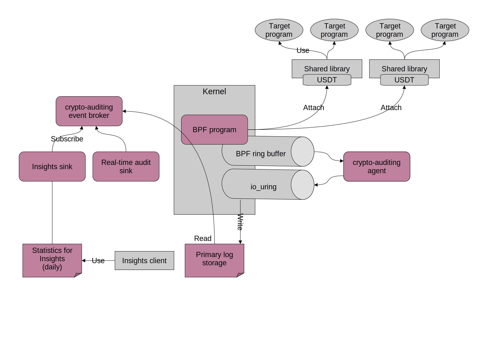

# Architecture

<!-- toc -->
- [Summary](#summary)
- [Design Details](#design-details)
  - [Architecture](#architecture)
  - [crypto-auditing agent](#crypto-auditing-agent)
  - [crypto-auditing event broker](#crypto-auditing-event-broker)
<!-- /toc -->

## Summary

This document provides an architectural overview of the
crypto-auditing project.

## Design Details

The following figure illustrates the proposed architecture.

At the highest level, the architecture can be seen as a variant of
[MQTT] (Message Queuing Telemetry Transport): the programs being
monitored acts as a publisher, the programs consume the collected
information act as a subscriber, and there will be intermediate
components that coordinate the communication flow between them.

- **crypto-auditing agent**: A program that receives events from publishers and write them onto the primary log storage
- **crypto-auditing event broker**: A program that accesses the primary log storage and notify the subscribers

### crypto-auditing agent

The responsibilities of crypto-auditing agent include:

- Install BPF program to monitor USDT
- Get notified an event when USDT is reached
- Write events to primary log storage

The agent is meant to work as fast as possible, while it shouldn't be
resource intensive, by utilizing asynchronous I/O mechanisms for
communicating with the publishers, through the kernel ([BPF ring
buffer] and [io_uring]).

### crypto-auditing event broker

The event broker is the only process which has direct access to the
primary log storage on behalf of the subscribers.  The
responsibilities of event broker include:

- Subscription management
  - Accept connections from subscribers
  - Deliver events to subscribers
  - For each event, ensure every subscriber receives it at most once
- Event management
  - Read events from primary log storage
  - Truncate primary log storage based on policies, such as certain time has elapsed, and/or all subscribers have read (or skipped) certain range of event sequence

The event broker caters for multiple types of subscribers: some may
periodically (daily, for example) check the log and calculate
statistics, and others may immediately consume events and provide
real-time diagnostics.

[MQTT]: https://mqtt.org
[BPF ring buffer]: https://www.kernel.org/doc/html/latest/bpf/ringbuf.html
[io_uring]: https://en.wikipedia.org/wiki/Io_uring

